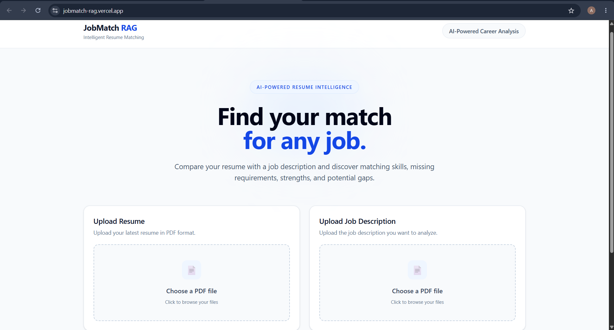

# JobMatch RAG 🤖

**Upload. Analyze. Match.**

JobMatch RAG is an AI-powered resume and job description matching platform built using **Retrieval-Augmented Generation (RAG)**. It analyzes a candidate's resume against a job description, identifies required and matching skills, highlights missing requirements, calculates a deterministic match score, and provides a grounded RAG assistant for asking questions about the candidate's resume.

The application combines **PDF document processing, text chunking, embeddings, FAISS vector search, Gemini-powered analysis, and a React-based interface** into a complete end-to-end AI application.

<p align="center">

  

  

  

  

  

  

  

</p>

---

## 🌍 Live Demo

| | |
|---|---|
| **Frontend** | [jobmatch-rag.vercel.app](https://jobmatch-rag.vercel.app/) |
| **Backend API** | [jobmatch-rag-backend.onrender.com](https://jobmatch-rag-backend.onrender.com/) |
| **GitHub Repository** | [github.com/pedapudiakhila/jobmatch-rag](https://github.com/pedapudiakhila/jobmatch-rag) |

> **Note:** The application uses the Google Gemini API for document analysis and question answering. Gemini API requests are subject to the quota and rate limits of the configured API project.

---

## ✨ Features

### 📄 Resume & Job Description Upload

- Upload resume in **PDF format**
- Upload job description in **PDF format**
- Independent file selection for resume and job description
- Client-side PDF validation
- Temporary server-side file handling
- Automatic cleanup of temporary uploaded files
- Clear upload and analysis states

### 🧠 AI-Powered Job Matching

JobMatch analyzes the uploaded documents and extracts structured information including:

- Required skills
- Candidate skills
- Matching skills
- Missing skills
- Relevant experience
- Candidate strengths
- Potential gaps

The analysis is performed using **Google Gemini** with explicit grounding instructions to reduce unsupported claims and hallucinations.

### 📊 Deterministic Match Score

The numerical match score is calculated separately from Gemini.

```text
Match Score =
(Matched Required Skills /
 Total Required Skills) × 100
```

For example:

**Required Skills**

```text
Python
React
REST APIs
AWS
Docker
```

**Matching Skills**

```text
Python
React
REST APIs
```

**Match Score**

```text
3 / 5 × 100 = 60%
```

Keeping the numerical calculation outside the language model makes the score deterministic for a fixed set of extracted skills.

### 🔎 RAG-Powered Resume Assistant

The application provides an interactive assistant for asking questions about the candidate.

Example questions:

- What technical skills does the candidate have?
- Does the candidate have AI experience?
- Does the candidate have AWS experience?
- What backend technologies has the candidate used?

The assistant:

1. Converts the question into an embedding
2. Searches the vector store
3. Retrieves relevant resume chunks
4. Builds a grounded context
5. Sends the context to Gemini
6. Generates an answer based on the retrieved information

### 📚 Source Attribution

Each RAG answer can include the retrieved source information:

- Source document
- Page number

This allows users to understand where the answer was retrieved from.

### 🛡️ Grounded AI Responses

The Gemini prompts explicitly instruct the model to:

- Use only the provided document context
- Avoid inventing skills
- Avoid inventing experience
- Avoid inventing projects
- Avoid inventing qualifications
- Avoid inventing technologies
- Avoid making unsupported claims about candidate preferences

If information is not supported by the available context, the system is instructed to indicate that it is unavailable.

### ⚡ Error Handling

The backend handles:

- Invalid file types
- Missing filenames
- Empty PDFs
- PDFs without readable text
- Empty document chunks
- Invalid questions
- Gemini API failures
- Gemini quota exhaustion
- Unexpected backend errors

The frontend displays user-friendly error messages instead of exposing raw backend exceptions.

---

## 🧩 How It Works

JobMatch RAG consists of two major workflows.

### Job Matching Workflow

```text
Resume PDF                         Job Description PDF
     |                                     |
     v                                     v
PDF Text Extraction                PDF Text Extraction
     |                                     |
     v                                     v
Resume Chunks                      JD Chunks
     |                                     |
     +----------------+--------------------+
                      |
                      v
             Document Context
                      |
                      v
                Gemini Analysis
                      |
                      v
             Structured Skill Data
                      |
                      v
          Deterministic Match Score
                      |
                      v
             Final Job Analysis
```

### RAG Question Answering Workflow

```text
Resume PDF
    |
    v
Text Extraction
    |
    v
Text Chunking
    |
    v
Embedding Generation
    |
    v
FAISS Vector Store
    |
    v
User Question
    |
    v
Query Embedding
    |
    v
Similarity Search
    |
    v
Top-K Relevant Chunks
    |
    v
Context Construction
    |
    v
Gemini
    |
    v
Grounded Answer
    |
    v
Sources + Page Numbers
```

---

## 🏗️ System Architecture

```text
                         ┌──────────────────────┐
                         │        USER          │
                         └──────────┬───────────┘
                                    │
                                    v
                         ┌──────────────────────┐
                         │   React Frontend     │
                         │   Vite + Tailwind    │
                         └──────────┬───────────┘
                                    │
                              REST API / HTTP
                                    │
                                    v
                         ┌──────────────────────┐
                         │    FastAPI Backend   │
                         └──────────┬───────────┘
                                    │
                   ┌────────────────┴────────────────┐
                   │                                 │
                   v                                 v
          ┌─────────────────┐              ┌──────────────────┐
          │ PDF Processing  │              │  Job Matching    │
          └────────┬────────┘              └─────────┬────────┘
                   │                                 │
                   v                                 v
          ┌─────────────────┐                 ┌──────────────┐
          │ Text Extraction │                 │    Gemini    │
          └────────┬────────┘                 └──────┬───────┘
                   │                                 │
                   v                                 v
          ┌─────────────────┐                 ┌──────────────┐
          │ Text Chunking   │                 │ Skill Data   │
          └────────┬────────┘                 └──────┬───────┘
                   │                                 │
                   v                                 v
          ┌─────────────────┐                 ┌──────────────┐
          │   Embeddings    │                 │ Match Score  │
          └────────┬────────┘                 └──────────────┘
                   │
                   v
          ┌─────────────────┐
          │ FAISS Vector DB │
          └────────┬────────┘
                   │
                   v
          ┌─────────────────┐
          │ Similarity      │
          │ Retrieval       │
          └────────┬────────┘
                   │
                   v
          ┌─────────────────┐
          │ Context Builder │
          └────────┬────────┘
                   │
                   v
             ┌────────────┐
             │   Gemini   │
             └─────┬──────┘
                   │
                   v
          ┌─────────────────┐
          │ Grounded Answer │
          │ + Sources       │
          └─────────────────┘
```

---

## 💻 Tech Stack

### Frontend

- React
- Vite
- Tailwind CSS
- Axios
- React Markdown

### Backend

- Python
- FastAPI
- Uvicorn
- Pydantic

### RAG & AI

- Google Gemini API
- FAISS
- Embeddings
- Retrieval-Augmented Generation

### Document Processing

- PyPDF
- LangChain Text Splitters

### Deployment

- Vercel — Frontend
- Render — Backend
- GitHub — Source Control

---

## 📁 Project Structure

```text
jobmatch-rag/
│
├── backend/
│   │
│   ├── app/
│   │   │
│   │   ├── rag/
│   │   │   ├── context_builder.py
│   │   │   ├── document_context.py
│   │   │   ├── document_loader.py
│   │   │   ├── embeddings.py
│   │   │   ├── generator.py
│   │   │   ├── rag_pipeline.py
│   │   │   ├── retriever.py
│   │   │   ├── text_splitter.py
│   │   │   └── vector_store.py
│   │   │
│   │   ├── services/
│   │   │   ├── analysis_service.py
│   │   │   ├── document_service.py
│   │   │   ├── job_matcher.py
│   │   │   ├── match_score.py
│   │   │   └── qa_service.py
│   │   │
│   │   └── main.py
│   │
│   ├── data/
│   │   ├── sample_job_description.pdf
│   │   └── sample_resume.pdf
│   │
│   ├── test_embeddings.py
│   ├── test_ingestion.py
│   ├── test_job_match.py
│   ├── test_rag.py
│   ├── test_retrieval.py
│   └── requirements.txt
│
├── frontend/
│   │
│   ├── src/
│   │   │
│   │   ├── components/
│   │   │   ├── FileUpload.jsx
│   │   │   ├── ListSection.jsx
│   │   │   ├── MatchScore.jsx
│   │   │   ├── Navbar.jsx
│   │   │   └── QuestionAnswer.jsx
│   │   │
│   │   ├── pages/
│   │   │   └── Home.jsx
│   │   │
│   │   ├── services/
│   │   │   └── api.js
│   │   │
│   │   ├── App.jsx
│   │   ├── index.css
│   │   └── main.jsx
│   │
│   ├── package.json
│   └── package-lock.json
│
├── .gitignore
├── README.md
└── render.yaml
```

---

## ⚙️ Installation

### 1. Clone the Repository

```bash
git clone https://github.com/pedapudiakhila/jobmatch-rag.git
cd jobmatch-rag
```

### 2. Backend Setup

Navigate to the backend:

```bash
cd backend
```

Create a virtual environment.

**Windows:**

```bash
python -m venv venv
venv\Scripts\activate
```

**macOS / Linux:**

```bash
python3 -m venv venv
source venv/bin/activate
```

Install dependencies:

```bash
pip install -r requirements.txt
```

Create a `.env` file inside `backend/`:

```env
GEMINI_API_KEY=your_gemini_api_key
```

Start the FastAPI server:

```bash
uvicorn app.main:app --reload
```

Backend:

```text
http://127.0.0.1:8000
```

Health check:

```text
http://127.0.0.1:8000/api/health
```

### 3. Frontend Setup

Open another terminal:

```bash
cd frontend
```

Install dependencies:

```bash
npm install
```

Start the development server:

```bash
npm run dev
```

The frontend will normally be available at:

```text
http://localhost:5173
```

---

## 🔐 Environment Variables

### Backend

Create:

```text
backend/.env
```

Add:

```env
GEMINI_API_KEY=your_gemini_api_key
```

The API key is used by the backend to communicate with Google Gemini.

> **Never commit `.env` files or API keys to GitHub.**

---

## 🔌 API Endpoints

### Health Check

| Method | Endpoint | Description |
|--------|----------|-------------|
| GET | `/` | Verify that the API is running |
| GET | `/api/health` | Backend health check |

### Job Analysis

| Method | Endpoint | Description |
|--------|----------|-------------|
| POST | `/api/analyze` | Analyze resume against a job description |

**Request:**

```text
multipart/form-data

resume: PDF file
job_description: PDF file
```

**Response includes:**

```text
match_score
required_skills
candidate_skills
matching_skills
missing_skills
relevant_experience
strengths
gaps
```

### RAG Question Answering

| Method | Endpoint | Description |
|--------|----------|-------------|
| POST | `/api/ask` | Ask a question about the candidate |

**Request:**

```json
{
  "question": "What technical skills does the candidate have?"
}
```

**Response includes:**

```text
answer
sources
```

Each source contains the document name and page number.

---

## 📊 Match Score Calculation

The match score is calculated by the backend using the extracted required and matching skill lists.

```text
matched_count / required_skill_count × 100
```

The score is rounded to one decimal place.

For example:

```text
Required Skills = 6
Matching Skills = 5

Score = (5 / 6) × 100

Score = 83.3%
```

The calculation is intentionally separated from Gemini's natural-language analysis.

This prevents the language model from directly deciding the final numerical percentage.

```text
Gemini
  ↓
Skill Extraction
  ↓
Python
  ↓
Deterministic Score
```

---

## 🧠 RAG Design

The RAG assistant follows a retrieval-first approach.

### Document Ingestion

```text
PDF
 ↓
PyPDF
 ↓
Extracted Text
 ↓
Document Chunks
 ↓
Embeddings
 ↓
FAISS
```

### Query Processing

```text
User Question
 ↓
Query Embedding
 ↓
FAISS Similarity Search
 ↓
Top-K Relevant Chunks
 ↓
Context Construction
 ↓
Gemini
 ↓
Grounded Answer
```

The retrieved chunks contain metadata such as:

```text
Source
Page
Document Type
```

This metadata is returned with the final answer to provide source attribution.

---

## 🎯 Why RAG?

Traditional LLM-based question answering can produce answers from the model's general knowledge.

For resume analysis, this can result in unsupported claims.

JobMatch RAG instead follows:

```text
User Question
      ↓
Retrieve Relevant Resume Content
      ↓
Provide Retrieved Context to Gemini
      ↓
Generate Grounded Answer
```

This allows the assistant to answer questions based on the candidate's actual uploaded document.

---

## 🔒 AI Safety & Grounding

The application explicitly instructs Gemini not to invent:

- Skills
- Work experience
- Projects
- Qualifications
- Technologies
- Achievements
- Candidate preferences

For example, if a job description requires regular travel but the resume does not mention travel availability, the system treats it as a potential gap rather than assuming that the candidate is willing to travel.

---

## 🧪 Testing

The backend contains separate test scripts for validating different parts of the RAG pipeline.

```text
test_embeddings.py
test_ingestion.py
test_job_match.py
test_rag.py
test_retrieval.py
```

### Frontend Production Build

Run:

```bash
npm run build
```

A successful build produces the production bundle inside:

```text
frontend/dist/
```

---

## 🚀 Deployment

### Frontend

The React frontend is deployed using Vercel.

```text
https://jobmatch-rag.vercel.app/
```

### Backend

The FastAPI backend is deployed using Render.

```text
https://jobmatch-rag-backend.onrender.com/
```

### Deployment Architecture

```text
                GitHub Repository
                       |
          +------------+------------+
          |                         |
          v                         v
       Vercel                    Render
          |                         |
          v                         v
 React Frontend              FastAPI Backend
          |                         |
          +----------HTTPS----------+
                       |
                       v
                 Gemini API
```

---

## 📸 Screenshots

### Home Page

The application provides a clean interface for uploading both the resume and job description.
<p align="center">
  
</p>

### Job Match Analysis

The results section displays:

- Match score
- Matching skills
- Missing skills
- Strengths
- Potential gaps
- Relevant experience

### RAG Assistant

Users can ask questions about the candidate and receive grounded answers along with source document information.

Screenshots can be added to this section as the project evolves.

---

## 🧱 Design Decisions

### Why FastAPI?

FastAPI provides a lightweight and structured framework for building the REST API and integrates naturally with Python-based AI and document-processing libraries.

### Why FAISS?

FAISS provides efficient vector similarity search and is used to retrieve relevant document chunks for the RAG assistant.

### Why Gemini?

Gemini is used for natural-language understanding, structured resume/JD analysis, and grounded answer generation.

### Why Separate Match Score Calculation?

Language model outputs can vary between generations.

Therefore, Gemini identifies and structures the relevant skills while Python performs the final numerical calculation.

```text
Gemini
  ↓
Skill Extraction
  ↓
Python
  ↓
Deterministic Score
```

### Why PDF Processing?

Resumes and job descriptions are commonly shared as PDF documents. JobMatch therefore processes PDF files directly and extracts their text before analysis.

---

## ⚠️ Limitations

- Analysis quality depends on the quality and readability of the uploaded PDFs.
- Image-only/scanned PDFs may not contain extractable text.
- Gemini API availability depends on the configured API project's quota.
- Match score depends on the skill lists extracted during document analysis.
- FAISS currently operates as an in-memory vector store during application runtime.
- Uploaded documents and analysis results are not persisted between application sessions.
- The application does not currently maintain long-term analysis history.

---

## 🔮 Future Improvements

- [ ] Persistent vector database
- [ ] User authentication and accounts
- [ ] Analysis history
- [ ] Multiple resume comparison
- [ ] Multiple job description comparison
- [ ] Improved skill normalization
- [ ] Advanced semantic skill matching
- [ ] ATS compatibility analysis
- [ ] Resume improvement suggestions
- [ ] Job recommendation system
- [ ] Candidate-job ranking
- [ ] Background processing for larger documents
- [ ] Evaluation metrics for retrieval quality
- [ ] Persistent user-specific document storage

---

## 📈 Learning Outcomes

This project demonstrates practical experience with:

- Retrieval-Augmented Generation
- Vector similarity search
- Embeddings
- FAISS
- Large Language Model integration
- Prompt engineering
- Structured JSON generation
- PDF document processing
- Text chunking
- FastAPI REST APIs
- React frontend development
- API integration
- Error handling
- Deterministic application logic
- Production deployment
- Vercel and Render deployment workflows

---

## 👩‍💻 Author

**Pedapudi Akhila**

B.Tech — Computer Science and Technology  
IIEST Shibpur

**GitHub:**  
https://github.com/pedapudiakhila

**Project Repository:**  
https://github.com/pedapudiakhila/jobmatch-rag

---

## 📄 License

This project is intended for educational and portfolio purposes.
